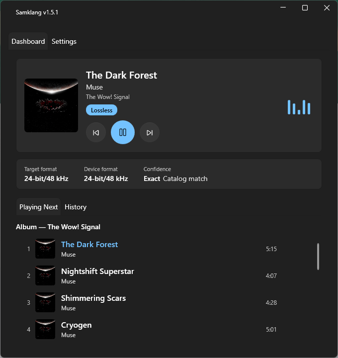
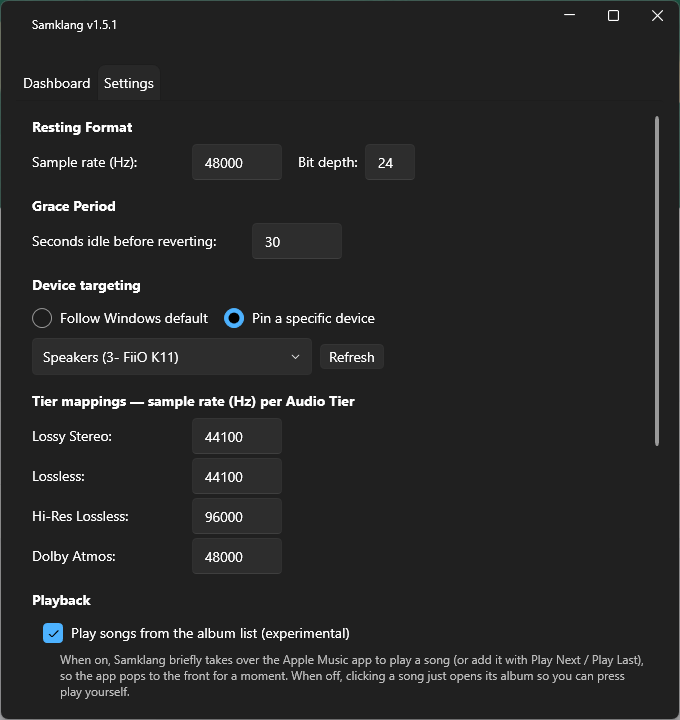

<div align="center">


# Samklang

**Bit-perfect Apple Music playback on Windows.**

<a href="https://github.com/Gholie/samklang/actions/workflows/ci.yml"></a>

<br />



</div>

*Samklang* (Norwegian: consonance — literally "together-sound") is a Windows 11 tray utility that retunes your audio device's format (sample rate + bit depth) to match the track currently playing in **Apple Music for Windows** — so lossless and hi-res tracks reach your DAC without being resampled.

> Early days, but it works. Expect rough edges and breaking changes.

## Why

Windows resamples every app's audio to the device's shared-mode format — the "Default Format" in the Sound control panel. If that's set to 48 kHz and Apple Music plays a 96 kHz hi-res track, you're not hearing hi-res, you're hearing a resample. Samklang watches what's playing and retunes the device so the track and the device agree — then quietly steps back out of the way when the music stops.

## Install

1. Grab the latest installer from the [Releases page](https://github.com/Gholie/samklang/releases) — download the `Samklang-win-Setup.exe` asset from the newest release. Releases are [immutable](https://docs.github.com/en/repositories/releasing-projects-on-github/immutable-releases) and every asset is attested by GitHub at publish time — verify a download with `gh attestation verify Samklang-win-Setup.exe --repo Gholie/samklang --predicate-type https://in-toto.io/attestation/release/v0.1`.
2. Run it. There's no wizard to click through — it installs to your user profile (no admin prompt) and launches Samklang when it's done.
3. Windows SmartScreen may warn about an "unknown publisher" the first time, because the installer isn't code-signed yet — click **More info → Run anyway**.

### First run

- Samklang starts minimized to the **system tray** (the icon area by the clock) — nothing pops up on first launch. Hover the icon for a tooltip with the current version, track, and applied format.
- Left-click (or double-click) the tray icon to open the dashboard: the current track with album artwork, playback controls (previous / play-pause / next), and a subtle playing animation, alongside its resolved format, confidence, and recent switch history — plus a **Settings** tab for device targeting, tier mappings, resting format, grace period, and "Start with Windows." Prefer plain text? Untick **Rich now-playing view** in Settings.
- Nothing needs configuring to get going: open Apple Music, play something, and Samklang picks up the track change and switches your default device's format automatically. Reach for Settings only if you want to pin a specific device, tweak tier→sample-rate mappings, or adjust the resting format and grace period.

<div align="center">



</div>

### What to expect

- **Tray icon, always running.** Closing the dashboard (the X) just hides it back to the tray — Samklang keeps watching in the background. Use the tray menu's **Exit** to actually quit.
- **A brief silence on format changes.** Switching a device's format live causes a short mute/rebuild hiccup. This is inherent to how Windows shared-mode audio works, not a bug.
- **Automatic updates.** Samklang checks GitHub Releases on every startup (and via the tray menu's **Check for Updates**) and applies newer versions in the background — no manual redownloads.
- **Settings live in `%APPDATA%`** as JSON. Delete the file to reset to defaults.

## Requirements

- Windows 11 (Windows 10 build 19041+ likely works, untested)
- [Apple Music for Windows](https://apps.microsoft.com/detail/9PFHDD62MXS1) with an Apple Music subscription
- To build from source: .NET 8 SDK

---

# Under the hood

Everything below is for the curious and for contributors. The short version: retuning a device to match a track sounds simple, but almost every piece of information Samklang needs is either undocumented, hidden, or actively misreported. Here's what got in the way and how it's handled.

## The resolver

The core job is deciding one number — the sample rate to switch the device to — for whatever is playing right now. Samklang runs a **layered resolver**: a chain of strategies from most precise to most approximate, stopping at the first that answers.

1. **Detect** — the Windows media session API (SMTC) reports track changes from the Apple Music app, and only that app; other players are ignored.
2. **Resolve** — each layer is more approximate than the last:
   - **Catalog match** — look the track up in Apple's web catalog and read the exact sample rate from its enhanced-HLS manifest (*Exact* confidence).
   - **PlayCache analysis** — probe the audio files Apple Music has cached locally and read the real codec back (*Exact* confidence, but heuristic matching).
   - **Tier fallback** — map the track's audio tier (lossless / hi-res-lossless / …) to a user-configured rate (*Tier-derived* confidence).

   Bit depth is always pinned to 24-bit; 16-bit content pads into it losslessly.
3. **Switch** — the device's shared-mode format is changed live via Core Audio policy configuration, clamped to the rates the device actually supports. You can follow the Windows default device or pin a specific one.
4. **Rest** — once playback has been idle past a grace period, the device reverts to your configured **resting format**, so games and movies aren't left stranded at 192 kHz.

The project's vocabulary is defined in [CONTEXT.md](CONTEXT.md); load-bearing decisions live in [docs/adr/](docs/adr/).

## Problems worth writing down

**Apple won't tell you the sample rate.** The documented Apple Music API exposes only a quality *tier* (`audioVariants`), never the actual rate — not at any price. So the catalog layer authenticates with the anonymous developer token embedded in the music.apple.com web player, calls `amp-api` with `extend=extendedAssetUrls`, and parses the track's enhanced-HLS manifest, whose ALAC entries carry literal `SAMPLE-RATE` and bit-depth attributes. This is unofficial and revocable, so the resolver must always degrade gracefully to the lower layers, never hard-fail. See [ADR 0001](docs/adr/0001-anonymous-web-token-for-catalog-access.md).

**The token scrape is a moving target.** Apple relocated the token inside the web bundle, breaking scraping outright — and hid a second bug behind it: live manifests use a media-group shape rather than the inline attributes we first parsed, so even a valid token returned nothing usable. The scraper now decodes and validates the token before trusting it, parses both manifest shapes, and when the session does break it backs off with bounded retries instead of permanently disabling itself.

**Apple Music lies about the artist.** The SMTC "artist" field from Apple Music for Windows isn't the artist — it's `Artist — Album`, em-dash and all. Feed that straight into a catalog search and you match nothing. Samklang splits the field back apart before looking a track up, and the catalog path is tested against *real* SMTC strings, not tidy ones.

**Same song, many masters.** The same song ships across multiple releases — single, album, deluxe edition — each with a different maximum ALAC rate. Picking the first hit can under- or over-shoot the rate that's actually streaming. The matcher ranks candidates by album context and compares sibling editions of the same recording, so the resolved rate matches what Apple's own hi-res badge promises.

**The local cache mostly evaporated.** PlayCache analysis was meant to be the offline safety net, but Apple moved streaming playback to PlayReady, and streamed tracks no longer write a `SubscriptionPlayCache` at all — the cache now only materializes for *downloaded* tracks. When a cached file does exist it's encrypted, so the codec has to be recovered from the encrypted `stsd` box's `sinf`/`frma` atoms rather than read off the surface. Useful, but no longer the primary source.

**Switching a live device is fiddly.** Probing which rates a device supports has to be done in exclusive mode using the device's *own* format layout, and extensible formats misreport their bit depth unless you read the valid-bits field specifically — get either wrong and you either reject rates the device supports or apply ones it doesn't. Format changes are clamped to the probed set and applied through Core Audio policy configuration.

**There's no play queue and no "play this track" button.** SMTC exposes no upcoming queue, so seamless switching at track boundaries is predicted from album order: after each catalog match, the next track's format is resolved into a one-slot buffer in the background, making the boundary switch instant when the prediction holds. And Apple Music deep links never autoplay — there's no queue URL and no SMTC verb to start a chosen track — so the opt-in "play this album track / Play Next / Play Last" feature drives the Apple Music app itself through UI Automation, working around row virtualization and menu scoping to find and click the right control.

## Building from source

Only needed if you're developing Samklang — see [Install](#install) if you just want to run it.

```powershell
dotnet build
dotnet test
```

### Releasing

Releases are cut by [release-please](https://github.com/googleapis/release-please), not by hand: Conventional Commits on `main` accumulate into an automatically maintained release PR (semver bump + changelog). Merging it creates a draft GitHub Release; the same workflow then builds the Velopack installer, attaches a build-provenance attestation, uploads the artifacts, and publishes the release — at which point installed copies pick the update up automatically.

## Prior art

Samklang stands on ideas proven by [LosslessSwitcher](https://github.com/vincentneo/LosslessSwitcher) (macOS) and [WindowsLosslessSwitcher](https://github.com/jordanmgibson/WindowsLosslessSwitcher) (Windows, GPL-3.0), independently re-imagined with a full status dashboard.

## License

[GPL-3.0-or-later](LICENSE).
